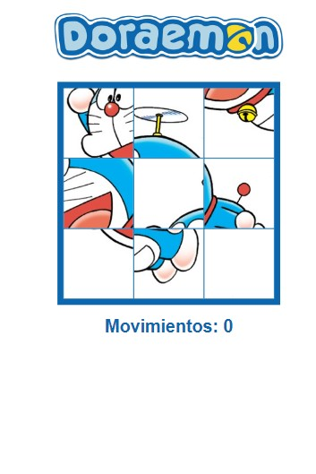

# Puzzle doraemon

   

## Características

- Contador de movimientos.
- Deslizamiento de fichas.

## Tecnologías Utilizadas

* *HTML:* Proporciona la estructura de la página web.
* *CSS:* Estiliza el juego y crea el diseño responsivo.
* *JavaScript:* Maneja la lógica del juego, la interacción del usuario y la animación.

## Instalación

1. Clona el repositorio: `git clone <https://github.com/nanditavelasquez/puzzle-doraemon>`
2. Abre el archivo `index.html` en tu navegador web.

## Uso

1. *Resolver:* Mueve las piezas del rompecabezas a sus posiciones correctas.
